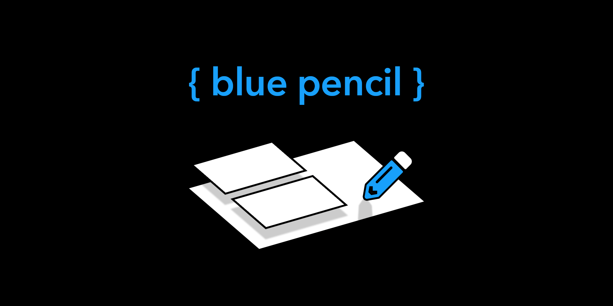

A plugin to manage the creation of formal design specs within Figma including frame numbering and naming as well as supporting features such as frame management and table of contents generation.

Current f

## Usage

## Development

Below are the steps to get your plugin running. This plugin template uses Typescript and NPM, two standard tools in creating JavaScript applications.

First, download Node.js which comes with NPM. This will allow you to install TypeScript and other libraries. You can find the download link here:

https://nodejs.org/en/download/

Next, install TypeScript using the command:

npm install -g typescript

The install all dependencies:

npm install

And finally build the plugin (also run after any changes to plugin):

npm run build

The source code entry point for the plugin is `src/index.ts` and the source code entry point for the ui is `src/index-ui.ts`. Rollup is used to bundle all of the generated javascript together and html-inject is used to embed all assets directly into the single `ui.html` file and a

We recommend editing the plugin using using Visual Studio code.

1. Download Visual Studio Code if you haven't already: https://code.visualstudio.com/.
2. Open this directory in Visual Studio Code.
3. To build the plugin you can run the build task using Ctrl/Cmd + Shift + B.
